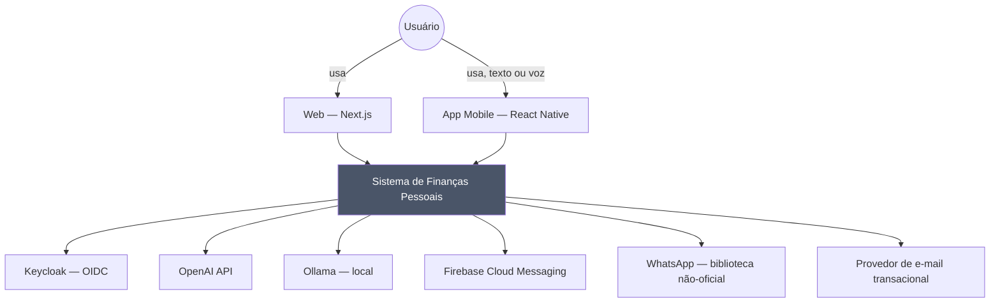
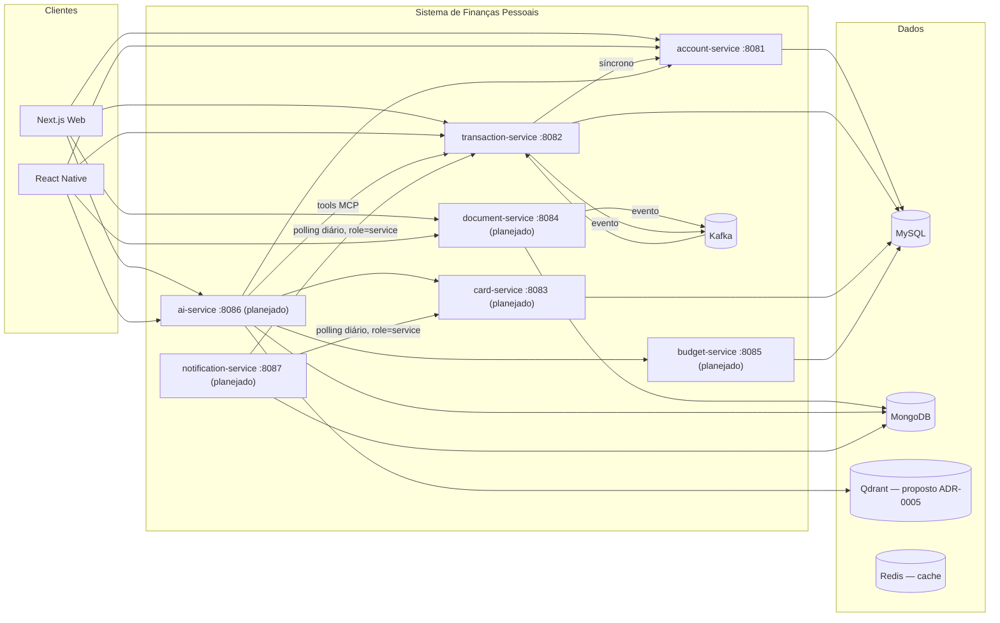
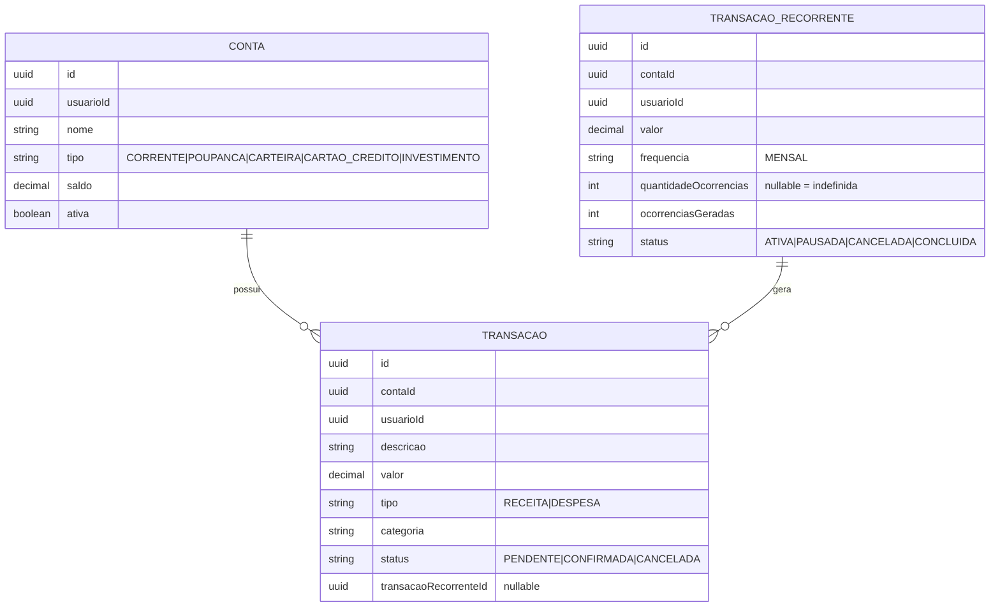
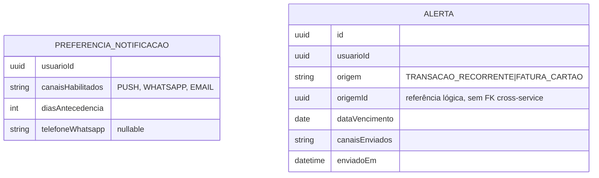
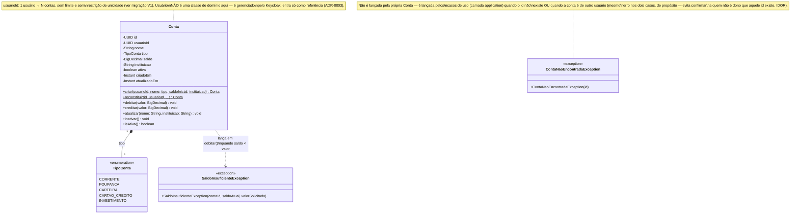
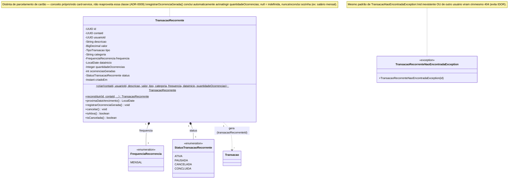
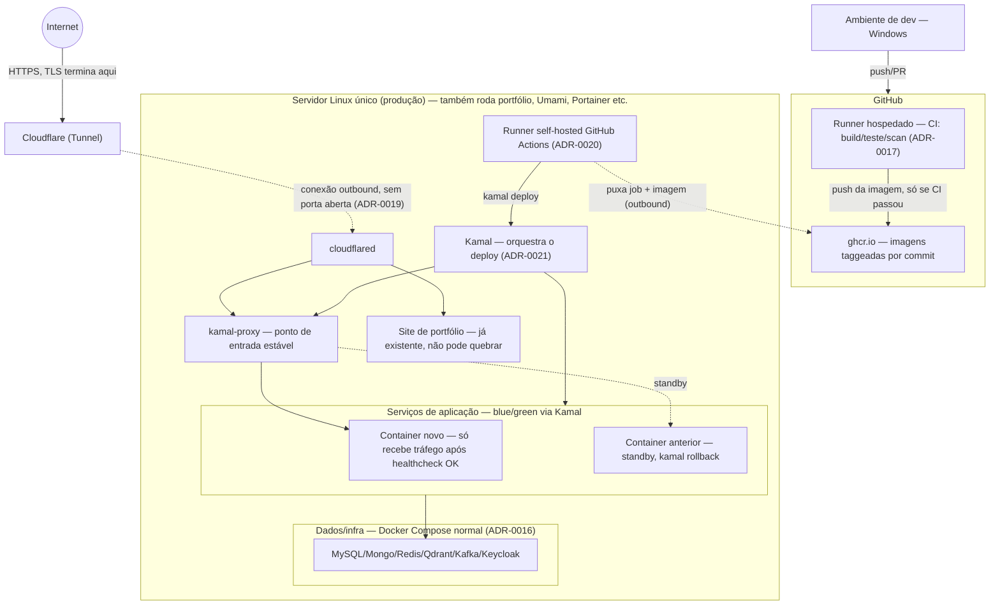

# Diagramas

> Documento vivo — atualizar quando um serviço/entidade/integração novo
> entrar em cena, não só quando "sobrar tempo". Diagramas de fluxo específico
> (sequência de um caso de uso) ficam perto do texto que os explica em
> `docs/architecture/overview.md` e `ai-strategy.md` — aqui ficam os
> diagramas estruturais (visão do todo) e um índice de tudo que existe.

## 1. Contexto (quem fala com o sistema)

Provedor de IA (OpenAI ou Ollama) e provedor de e-mail são escolhas
configuráveis, não fixas — ver ADR-0002 e ADR-0013.

## 2. Containers / serviços

Detalhe de cada serviço (responsabilidade, porta, banco, status) na tabela
de `docs/architecture/overview.md` seção 2 — não duplicado aqui.

## 3. Modelo de domínio

### 3.1 `account-service` + `transaction-service`

Contrato completo (campos, validação) em
`docs/specs/account-service.yaml` e `docs/specs/transaction-service.yaml` —
este diagrama é o mapa, não a fonte da verdade dos campos.

### 3.2 `notification-service`

Banco separado (*database-per-service*, ADR-0001) — sem FK real com o
domínio acima, só referência lógica por id (`origemId`).

### 3.3 Pendente

`card-service` e `budget-service` ainda não têm contrato OpenAPI (roadmap
#2 e #4) — modelo de domínio deles entra aqui quando a spec for escrita
(spec-driven, ver `CLAUDE.md`), não antes.

## 4. Diagrama de classes

Diferente do modelo de domínio (seção 3, conceitual/ER), aqui é o desenho
das classes de código de verdade — atualizar junto quando o domínio mudar,
não deixar decolar do código.

### 4.1 `account-service` — domínio

Regras que esse diagrama expressa:

- **1 usuário → N contas.** `usuarioId` é obrigatório e imutável em `Conta`,
  mas não há unicidade — um usuário pode ter quantas contas quiser, de
  qualquer combinação de `TipoConta`.
- **`usuarioId` nunca vem do cliente.** Todo caso de uso que muta ou lê uma
  conta específica (`buscar`, `atualizar`, `excluir`, `criar`) recebe o
  `usuarioId` já resolvido pelo `ContaResource` a partir do claim `sub` do
  token — nunca de um campo de request. Isso é o que garante "o usuário
  existe" (só chega até aqui quem tem token válido do Keycloak) e evita um
  usuário agir em nome de outro.
- **Saldo nunca fica negativo.** `debitar()` valida internamente e lança
  `SaldoInsuficienteException` antes de alterar o estado — não existe
  caminho no código pra saldo ficar negativo.
- **Exclusão é sempre lógica.** `inativar()` marca `ativa=false`; não existe
  método de exclusão física na classe. Idempotente — inativar de novo não
  quebra nada.
- **`atualizar()` só mexe em nome/instituição.** `tipo`, `saldo` e
  `usuarioId` não são editáveis por esse método — saldo só muda via
  `debitar`/`creditar`, e trocar o dono de uma conta não é uma operação que
  existe.
- **Dois construtores, duas intenções.** `criar()` valida como criação nova
  (regras de negócio de entrada); `reconstituir()` é usado só pela
  persistência pra remontar um objeto que já existia, sem reaplicar
  validação de criação.

### 4.2 `transaction-service` — domínio

```mermaid
classDiagram
    class Transacao {
        -UUID id
        -UUID contaId
        -UUID usuarioId
        -String descricao
        -BigDecimal valor
        -TipoTransacao tipo
        -String categoria
        -LocalDate dataTransacao
        -StatusTransacao status
        -UUID transacaoRecorrenteId
        -Instant criadoEm
        +criar(contaId, usuarioId, descricao, valor, tipo, categoria, dataTransacao)$ Transacao
        +reconstituir(id, contaId, ...)$ Transacao
        +atualizar(descricao, valor, categoria, dataTransacao) void
        +cancelar() void
        +isCancelada() boolean
    }

    class TipoTransacao {
        <<enumeration>>
        RECEITA
        DESPESA
    }

    class StatusTransacao {
        <<enumeration>>
        PENDENTE
        CONFIRMADA
        CANCELADA
    }

    class AccountServiceClient {
        <<port>>
        +debitar(contaId, valor) void
        +creditar(contaId, valor) void
    }

    class ContaNaoEncontradaException {
        <<exception>>
        +ContaNaoEncontradaException(contaId)
    }

    class SaldoInsuficienteException {
        <<exception>>
        +SaldoInsuficienteException(contaId)
    }

    class TransacaoNaoEncontradaException {
        <<exception>>
        +TransacaoNaoEncontradaException(id)
    }

    class TransacaoCanceladaException {
        <<exception>>
        +TransacaoCanceladaException(id)
    }

    class IntervaloInvalidoException {
        <<exception>>
        +IntervaloInvalidoException(inicio, fim)
    }

    Transacao "1" *-- "1" TipoTransacao : tipo
    Transacao "1" *-- "1" StatusTransacao : status
    AccountServiceClient ..> ContaNaoEncontradaException : lança
    AccountServiceClient ..> SaldoInsuficienteException : lança em debitar()

    note for TransacaoNaoEncontradaException "Mesmo padrão do ContaNaoEncontradaException:\nid inexistente OU de outro usuário viram o\nmesmo 404 (evita IDOR)."

    note for TransacaoCanceladaException "Lançada por AtualizarTransacaoUseCase quando o\nchamador tenta editar uma transação já CANCELADA\n(mapeada pra 422 — regra de negócio, não erro de input)."

    note for IntervaloInvalidoException "Lançada por ResumoPorCategoriaUseCase quando início\nvem depois de fim (mapeada pra 400 — erro de input,\nnão regra de negócio como as duas acima)."

    note for Transacao "Nasce sempre CONFIRMADA — quando criar() roda, o\nefeito no saldo já aconteceu (RegistrarTransacaoUseCase\nchama o account-service ANTES de persistir). PENDENTE\nfica pra um fluxo futuro (ex: importação de documento).\natualizar() não mexe em contaId/tipo/usuarioId — trocar\nde conta ou tipo é cancelar e recriar (evita ambiguidade\nde reversão de saldo entre contas diferentes)."
    note for AccountServiceClient "Porta pro account-service (chamada síncrona).\nA implementação faz 2 chamadas com 2 tokens diferentes:\nGET /contas/{id} com o token do próprio usuário\n(confirma posse — reusa o 404 do account-service,\nevita IDOR) e POST /contas/{id}/debitos|creditos\ncom token de serviço (client_credentials)."
```

Regras que esse diagrama expressa:

- **Débito/crédito acontece antes de persistir.** `RegistrarTransacaoUseCase`
  (camada application, fora deste diagrama de domínio) chama
  `AccountServiceClient` antes de `Transacao.criar()` — se a chamada
  falhar, nada é salvo (sem transação "fantasma").
- **`AccountServiceClient` é uma porta só de saída.** O domínio não sabe
  que existe HTTP, OIDC ou dois tokens diferentes — isso é tudo detalhe de
  `infrastructure.client` (ver `services/transaction-service/README.md`).
- **`usuarioId` nunca vem do cliente**, mesmo padrão do `account-service`
  (ADR-0003) — extraído do token em `TransacaoResource`.
- **Cancelar reverte o efeito original.** `cancelar()` é só uma mudança de
  estado (idempotente); quem decide reverter o saldo é
  `CancelarTransacaoUseCase`, que chama `AccountServiceClient` com a
  operação oposta à original (`DESPESA` → credita de volta, `RECEITA` →
  debita de volta) **antes** de marcar `CANCELADA` — mesma ordem
  "efeito externo primeiro" usada em `criar()`.
- **Resumo por categoria não chama o `account-service`.**
  `ResumoPorCategoriaUseCase` só lê `Transacao` já persistida (soma
  `DESPESA` `CONFIRMADA` num período, agrupada por categoria) — cálculo
  puramente local, sem efeito colateral externo.

### 4.3 `transaction-service` — `TransacaoRecorrente`

Regras que esse diagrama expressa:

- **`CriarTransacaoRecorrenteUseCase` reusa `RegistrarTransacaoUseCase`**
  pra gerar cada ocorrência — mesmo caminho síncrono com o
  `account-service` de uma transação avulsa (debita/credita antes de
  persistir), sem duplicar a lógica de efeito no saldo.
- **`GerarOcorrenciasRecorrentesJob` (scheduler) é um wrapper fino** sobre
  `GerarOcorrenciasRecorrentesUseCase`, que recebe a data "hoje" como
  parâmetro em vez de ler o relógio do sistema — permite testar geração de
  ocorrência, limite de `quantidadeOcorrencias` e regra indefinida sem
  `Thread.sleep` nem tempo real. Gera no máximo 1 ocorrência por regra por
  execução; atraso do job é recuperado incrementalmente nas execuções
  seguintes, não tudo de uma vez.
- **Cancelar não afeta ocorrências já geradas.** `cancelar()` só impede
  novas `Transacao`s de serem criadas pela regra — as que já existem
  continuam normalmente (têm vida própria, editáveis/canceláveis via
  `/transacoes/{id}` como qualquer outra).

## 5. Implantação (produção)

Ver ADR-0016 (topologia, servidor único), ADR-0019 (ingress via Cloudflare
Tunnel), ADR-0020 (runner self-hosted) e ADR-0021 (Kamal, zero-downtime +
rollback) — detalhe completo em `docs/architecture/deployment.md`. Nenhum
nome real de domínio/host aparece aqui de propósito.

## 6. Fluxos de sequência (índice)

Ficam embutidos perto do texto que os explica, não duplicados aqui:

- Ingestão de documento → transação — `overview.md` seção 3.
- Comando em linguagem natural (consulta e ação) — `overview.md` seção 4,
  `ai-strategy.md` seções 5 e 6.
- Alerta de vencimento — `overview.md` seção 5.
