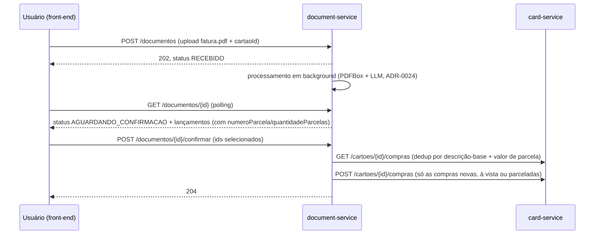
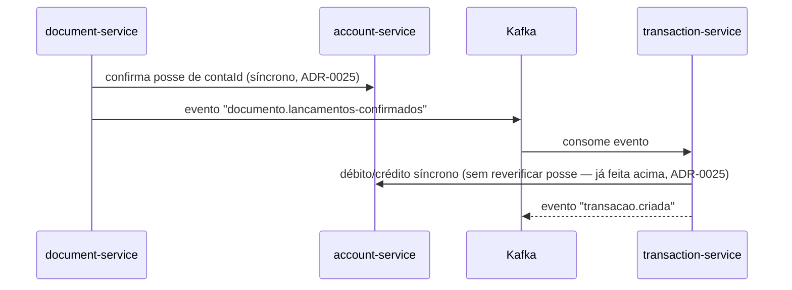
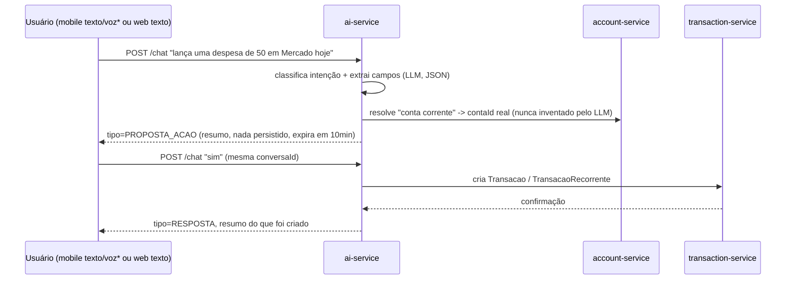
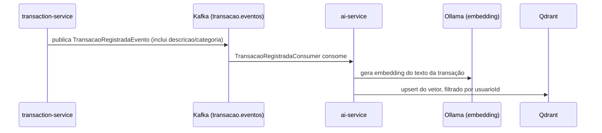
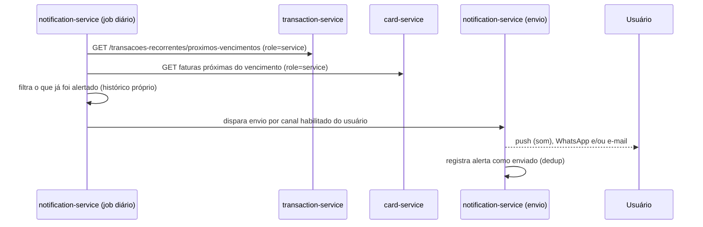
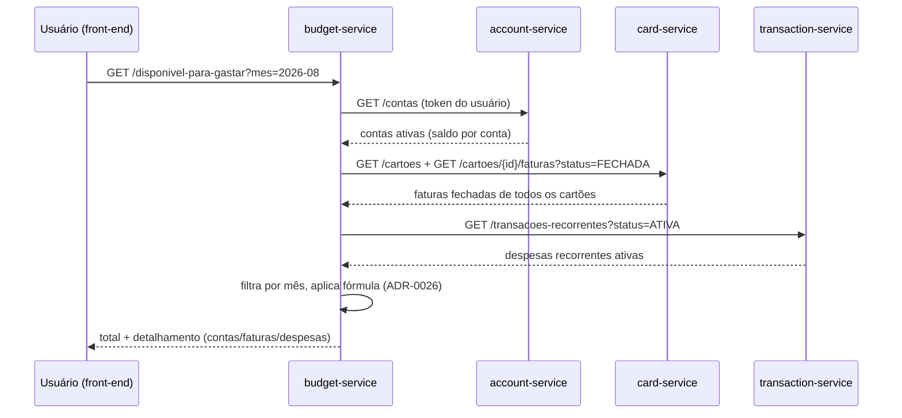

# Arquitetura — Visão Geral

> Como o sistema é composto. Porquês de decisões específicas ficam nos ADRs
> (`docs/architecture/adr/`); isso aqui é o mapa.

## 1. Estilo arquitetural

Microsserviços por domínio, *database-per-service*, comunicação síncrona
(REST) quando a resposta é necessária imediatamente e precisa de consistência
forte, eventos assíncronos (Kafka) para propagar mudanças de domínio entre
serviços que não precisam de resposta imediata. Ver ADR-0001 para o porquê de
microsserviços em vez de monólito nesse projeto.

## 2. Serviços

| Serviço | Responsabilidade | Porta | Banco | Status |
|---|---|---|---|---|
| `account-service` | Contas financeiras (criar, listar, debitar/creditar saldo) | 8081 | MySQL (`account_db`) | ✅ Entregue — CRUD completo + débito/crédito, 45 testes, CI verde |
| `transaction-service` | Registrar/consultar transações (inclusive recorrentes, ver ADR-0009); chama `account-service` p/ refletir no saldo | 8082 | MySQL (`transaction_db`) | ✅ Entregue — registrar/listar/editar/cancelar/resumo/recorrentes, 91 testes, CI verde |
| `card-service` | Cartões de crédito, faturas, parcelamento — independente de `TipoConta.CARTAO_CREDITO` (ADR-0022) | 8083 | MySQL (`card_db`) | ✅ Entregue — CRUD de cartão + fatura/parcelamento/pagamento, 82 testes, CI verde |
| `document-service` | Upload e parsing de fatura de cartão (PDF) via LLM local (Ollama, ADR-0002); extrato (PDF/CSV) e boleto de financiamento (ADR-0014) ficam pra fatias seguintes; no mobile, foto entra também depois (ADR-0015); gera lançamentos pendentes, usuário confirma, cada um vira compra nova (à vista/parcelada) no `card-service` — dedup entre uploads, sem transação/evento Kafka pra fatura de cartão (ADR-0028) | 8084 | MongoDB (documento bruto + resultado do parsing) + MySQL (lançamentos pendentes) | ✅ Entregue (fatura PDF) — upload assíncrono + extração LLM + confirmação + integração card-service, 100+ testes, CI verde |
| `budget-service` | Orçamento por categoria/mês, cálculo de "disponível pra gastar" — cruza account-service/card-service/transaction-service de forma síncrona (ADR-0026) | 8085 | MySQL (`budget_db`) | ✅ Entregue — orçamento + disponível pra gastar, 49 testes, CI verde |
| `ai-service` | Orquestração de agentes, RAG, chat em linguagem natural, ação por comando (criar transação) — cruza account/budget/card/transaction-service de forma síncrona | 8086 | Qdrant (vetores, ADR-0005) + MongoDB (conversas + configuração de IA), primeiro serviço sem MySQL | ✅ Entregue — chat (consulta + ação com confirmação), RAG via evento Kafka, 64 testes, CI verde |
| `notification-service` | Alertas de vencimento (despesa recorrente, fatura de cartão) via push/WhatsApp/e-mail; preferências de notificação por usuário | 8087 | MongoDB | Planejado |

Cada serviço tem seu contrato em `docs/specs/<nome-do-servico>.yaml`, escrito
**antes** do código (spec-driven). Não há mais um "BFF/gateway web" como
serviço separado — esse papel foi absorvido pelo Next.js (ver ADR-0006).

## 2.1 Clientes

| Cliente | Framework | Fala com os serviços via | Entrada de comando IA |
|---|---|---|---|
| Web | Next.js (React) | Server Components/Route Handlers do próprio Next.js, que agregam os microsserviços (papel de BFF) — ver ADR-0006 | Só texto |
| Mobile | React Native | Chama os microsserviços diretamente (sem BFF — não há processo Next.js no dispositivo). Se a agregação client-side ficar repetitiva entre web e mobile, revisitar com um ADR (ex: gateway HTTP dedicado) — não antecipar essa complexidade agora | Texto ou voz (transcrita no dispositivo, nunca enviada como áudio — ADR-0008) |

UX, identidade visual, tipografia e paleta de cores ainda não foram
definidos — ficam para quando começarmos a fatia de front-end (roadmap #6).

## 3. Fluxo: ingestão de documento → transação

**Fatura de cartão** (`TipoDocumento.FATURA_CARTAO`, único tipo
implementado) religa no `card-service` desde a ADR-0028 (2026-08-11) — não
passa mais pelo Kafka/`transaction-service`:

Ponto chave: o `document-service` nunca cria transação nem debita conta
sozinho — cada lançamento confirmado (exceto RECEITA/estorno, limitação
conhecida) vira uma compra no `card-service`, que já sabia distribuir
parcela em faturas futuras e fechar fatura vencida sozinho (fatia 2). O
dinheiro só sai da conta quando o usuário paga a fatura explicitamente
(`POST /faturas/{id}/pagar`, síncrono com `account-service`) — nunca no
momento da importação. `EXTRATO_BANCARIO`/`BOLETO_FINANCIAMENTO` (ainda não
implementados) continuam previstos pro fluxo antigo abaixo, que seguiu
existindo pra esse fim (ver ADR-0025).

Fluxo antigo, ainda válido pra tipos de documento que geram transação
avulsa direta (nenhum implementado ainda):

Upload é **assíncrono** (ADR-0024) — testado na prática que a extração via
LLM local pode levar minutos, não segundos, pra fatura com muitos
lançamentos; segurar isso numa única requisição HTTP síncrona não era
viável. Cliente sonda `GET /documentos/{id}` até o status sair de
`PROCESSANDO`.

Compra já conhecida de um upload anterior não é lançada de novo — dedup por
assinatura (descrição-base + valor de parcela, **sem** comparar
quantidade de parcelas: quando a fatura é importada no meio de uma
sequência, ex. "Parcela 8/11", o `card-service` guarda só as parcelas
restantes, então esse número não é estável entre uploads, achado real
2026-08-11). Foto (mobile) entra no mesmo ponto do fluxo de upload — só
muda a estratégia de extração usada dentro do processamento em background
(ADR-0015).

## 4. Fluxo: comando em linguagem natural (`ai-service`)

Ver `docs/architecture/ai-strategy.md` para o detalhe completo. Um único
endpoint (`POST /api/v1/chat`) atende pergunta nova, comando de ação,
correção e confirmação — o `AgenteOrquestradorUseCase` decide a intenção a
partir do texto + estado da conversa (`Conversa`, MongoDB, com `Mensagem` e
`AcaoPendente` embutidos). Diferente do `document-service`, não existe
endpoint `/confirmar` separado — a confirmação é conversacional
("sim"/"confirmo"/"pode criar"/…, casamento de palavra-chave, não uma
segunda chamada ao LLM).

### 4.1 Consulta (só leitura)

O LLM classifica a intenção e a tool (`CONSULTA` + `buscar_saldo_disponivel`
/`resumo_categoria`/`buscar_transacoes_similares`/…), o `ai-service` chama o
serviço correspondente (`budget-service` para números exatos,
`VectorStore`/Qdrant para busca semântica sobre transações via RAG) e monta
a resposta final **sempre por template Java**, nunca pelo texto livre do
LLM — os números exatos vêm da chamada determinística, o LLM só ajuda a
entender a pergunta.

### 4.2 Ação (cria transação)

*voz é transcrita no próprio dispositivo antes de chegar aqui — ver ADR-0008.

Mesmo princípio de confirmação explícita usado no fluxo de documento (seção
3) — nenhuma mutação de dado financeiro acontece sem o usuário confirmar
vendo exatamente o que vai ser criado. Ver ADR-0007. `contaId` nunca é
extraído/inventado pelo LLM — é sempre resolvido de forma determinística no
`ai-service` via `account-service`; se não resolver, o agente pergunta qual
conta usar em vez de propor uma ação.

### 4.3 Indexação para RAG

Embedding de indexação **sempre** usa Ollama, mesmo que o usuário tenha
escolhido OpenAI como provedor de chat — modelos de embedding diferentes
geram vetores de dimensão diferente e a coleção do Qdrant tem dimensão
fixa (768, `nomic-embed-text`). Ver `ai-strategy.md`.

## 5. Fluxo: alerta de vencimento

Ver ADR-0010 (por que polling em vez de evento Kafka aqui), ADR-0011 (push/
FCM), ADR-0012 (WhatsApp via biblioteca não-oficial, risco assumido) e
ADR-0013 (e-mail, proposta). Os três canais são independentes — falha num
não afeta os outros (PRD seção 4).

## 6. Fluxo: "disponível pra gastar" (`budget-service`)

Três chamadas síncronas de leitura, todas propagando o token do próprio
usuário (mesmo padrão de dois tokens já usado em
`document-service`→`account-service`, ADR-0025) — nenhuma confirma posse
de um id específico, porque os cinco endpoints chamados já filtram pelo
`sub` do token no servidor. O filtro por mês (fatura por
`dataVencimento`, despesa recorrente por `dataInicio`) acontece dentro do
`budget-service`, não nos clientes — `account-service`/`card-service`/
`transaction-service` continuam devolvendo dado bruto, sem saber "qual
mês" foi pedido. Regra exata da fórmula e o porquê de cada parcela:
ADR-0026.

`POST/GET/PUT/DELETE /orcamentos` (orçamento por categoria/mês) segue o
mesmo princípio de leitura síncrona, mas só chama `transaction-service`
(`GET /transacoes/resumo-por-categoria`, endpoint já existente, mesmo
cálculo do dashboard/IA) — não tem diagrama próprio por ser mais simples
que o fluxo acima.

## 7. Multi-tenancy

Todo dado é particionado por `usuarioId`. Autenticação/autorização via
Keycloak (OIDC) — token carrega o `usuarioId` (subject) e roles
(`usuario`/`admin`/`service`). Toda query em todo serviço filtra por
`usuarioId` do token, nunca por parâmetro livre não validado contra o token.
Endpoints internos serviço-a-serviço usam role `service` (client credentials),
nunca expostos ao front-end. Ver ADR-0003.

## 8. Comunicação e consistência

- **Síncrono (REST)**: quando a operação precisa de efeito imediato e
  consistente (ex: transação → débito de saldo). Retry + timeout via SmallRye
  Fault Tolerance cobrem falha transitória de rede.
- **Assíncrono (Kafka)**: para propagação de eventos de domínio que outros
  serviços reagem sem precisar bloquear quem gerou o evento (ex:
  `conta.eventos`, `transacao.eventos`, `documento.eventos`). Formato ainda
  JSON cru; evolução para CloudEvents/Avro + schema registry é item de
  roadmap, não bloqueante.

## 9. Stack completa

Ver tabela no `README.md` raiz — não duplicado aqui pra evitar dessincronia
entre os dois arquivos. Se a stack mudar, atualize os dois.
